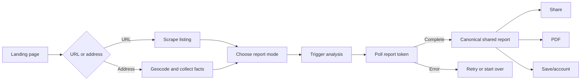

# End-to-end user journey audit

## Journey map

The architecture is understandable and the token-based handoff gives every completed report a stable URL. The largest gap is that the product UI looks more complete than the underlying state machine, account system and paid actions actually are.

## 1. Landing and product orientation

### What works

- The landing page gives one clear starting point and distinguishes URL from address input.
- The four audiences are visible before purchase and sample report cards communicate that the product changes by intent.
- Recent copy correctly calls the verdict deterministic and labels the comparable-sales sample.

### Findings

| ID   | Severity | Finding                                                                                                                                                    | Evidence                                                                          | Proposed response                                                                                                       |
| ---- | -------- | ---------------------------------------------------------------------------------------------------------------------------------------------------------- | --------------------------------------------------------------------------------- | ----------------------------------------------------------------------------------------------------------------------- |
| J-01 | P1       | The page says it accepts “Any Canadian listing URL” and explicitly advertises Zillow.ca, but the Zillow scraper is deferred.                               | `LandingPage.tsx` lines 1994 and 1128; `validateUrl.ts`; unported Zillow scraper. | Promise Realtor.ca only until a second source passes the same live gates. Address entry can remain the fallback.        |
| J-02 | P1       | Report cards advertise features that the live route does not consistently provide, especially landlord report functionality and personal comparable sales. | `LandingPage.tsx` report descriptions; `ReportPage.tsx` mode routing.             | Generate the feature list from a capability matrix with states: live, sample, estimated, coming soon.                   |
| J-03 | P1       | Pricing advertises portfolio-level reporting, white-label PDF and SunScout 3D without complete flows behind each claim.                                    | `LandingPage.tsx` pricing section.                                                | Remove or label each unavailable benefit before accepting payment for it.                                               |
| J-04 | P2       | The landing page is roughly 2,900 lines and contains navigation, production input orchestration, demo report components, pricing and FAQ data together.    | `LandingPage.tsx`.                                                                | Split by section and isolate demo fixtures from production entry logic. This reduces accidental cross-flow regressions. |
| J-05 | P2       | “Under sixty seconds, every time” is an absolute claim even though scraper, calc engine and third-party services can time out or fail.                     | `LandingPage.tsx` lines 2004, 2011 and 2828.                                      | Use a measured percentile and date, or say “typically.” Instrument before publishing a number.                          |

## 2. Input classification and validation

### URL path

The classifier accepts common URLs and the validator checks supported domains. The user receives useful error types for unsupported province and scraper failure.

Gaps:

- Domain validation accepts Zillow.ca although its runtime path is not supported.
- A valid provider URL says nothing about listing freshness, status, or whether a page represents a single property.
- The scrape response's `missingFields` does not cover every consequential unknown. A missing property type, beds, baths or parking value can pass through as a default.
- Scraper property-type mapping defaults an unrecognized value to `detached`. This creates a confident category from absence and can alter maintenance estimates.

### Address path

The geocoder rejects weak matches and requires a full Ontario postal code, a strong safeguard against analyzing a street centroid. Reattaching the unit preserves the address the user entered.

The details form needs an evidence model rather than numeric defaults:

| Field         | Current behavior                                 | Risk                                                       | Better behavior                                              |
| ------------- | ------------------------------------------------ | ---------------------------------------------------------- | ------------------------------------------------------------ |
| Property type | Not collected by the UI; API defaults to condo.  | Changes maintenance, fee expectations and report language. | Required explicit selection with Unknown available.          |
| Bedrooms      | Required in UI, API still accepts omission as 0. | Bad comp matching; studio and unknown are conflated.       | Model studio separately; reject omitted value.               |
| Bathrooms     | Optional, omitted becomes 0.                     | Report can assert zero baths.                              | Nullable with provenance.                                    |
| Parking       | Not collected, becomes 0.                        | “No parking” can appear as fact.                           | Nullable and ask whether included/extra/none/unknown.        |
| Condo fee     | Optional and has a known flag.                   | Good underlying pattern, but property type is unknown.     | Show only for relevant types and preserve explicit “no fee.” |
| Annual tax    | Optional and estimated later.                    | Estimate can look equivalent to listing fact.              | Return amount, method, source date and confidence.           |

## 3. Mode selection

The modal asks one decision that materially changes report interpretation. Sale listings map to investor/personal; rental listings map to tenant/landlord.

Findings:

- It says “You can switch later from inside the report,” but no report-level switch exists.
- The modal runs an artificial progress bar to 100% and says `~12s` before it calls `onSelect`; it is delay theatre, not analysis progress.
- Mobile behavior is selected through `window.innerWidth` rather than CSS/media-query primitives, increasing resize and test drift.
- Keyboard Escape works, but the desktop modal does not implement the same focus trap and focus restoration used by the upgrade modal.

Recommendation: make selection immediate, remove the fake timing, and either build a mode switch that reuses the same listing or remove the promise. For sale listings, later investor-strategy selection belongs inside the investor report because it changes interpretation, not the raw facts.

## 4. Analysis progress and failure recovery

The analyzing screen triggers `POST /analysis` and polls every two seconds. Its progress display is synthetic: backend status maps to milestones and the UI eases toward them. The individual step labels are not backed by per-step events.

| ID   | Severity | Finding                                                                                                     | Consequence                                                                    | Proposed response                                                                               |
| ---- | -------- | ----------------------------------------------------------------------------------------------------------- | ------------------------------------------------------------------------------ | ----------------------------------------------------------------------------------------------- |
| J-06 | P1       | `updateAnalysisStatus` is a no-op; `getAnalysisStatus` returns pending until calculated metrics exist.      | Backend failures remain pending forever.                                       | Persist a real state enum, failure code, timestamps and attempt count.                          |
| J-07 | P1       | There is no polling deadline or exponential backoff.                                                        | A stuck job creates endless traffic and no resolution.                         | Add a bounded client deadline and a server job timeout; expose retry safely.                    |
| J-08 | P1       | A transient polling fetch error ends the flow instead of retrying.                                          | Short network interruptions become user-visible failures.                      | Retry idempotent reads with jitter; distinguish offline, server failure and expired token.      |
| J-09 | P2       | Progress steps claim comps, neighborhood and investment calculations regardless of mode or service success. | The UI can imply evidence was fetched when it was unavailable.                 | Emit truthful server stages and optional-source outcomes, or use a neutral indeterminate state. |
| J-10 | P2       | Cancel stops browser polling but does not cancel server work.                                               | Wasted compute and confusing semantics.                                        | Relabel to “Leave this page,” or support cancellable jobs.                                      |
| J-11 | P2       | Reloading the analyzing route can retrigger analysis.                                                       | Duplicate expensive extraction/calculation work and variable completion races. | Make trigger idempotent by token, mode and analysis version.                                    |

## 5. Canonical report routing

The shared `/r/:token` route is the source of truth and should render the same product the demos advertise. It currently does not:

- Tenant and personal reports return their specialized full pages early.
- Investor uses a separate `InvestorReportContent` implementation inside `ReportPage` rather than the standalone investor page.
- Landlord uses that same investor content with a changed view label.
- A second, obsolete `TenantReportContent` remains in `ReportPage` even though the live tenant path returns earlier.

Recommendation: create one mode registry where each report mode has one canonical component, one data adapter, one entitlement policy and one PDF representation. Demo routes should pass fixtures into those same components.

## 6. Share, save and export

### Share

Copying the canonical URL works in the report body. The header's “Share link” control has no click handler, and clipboard actions lack visible success/failure feedback. Share tokens expire after 30 days, which matches current landing copy.

### Save

Most sticky `onSave` handlers are no-ops. The navigation Save button either opens an upgrade modal or calls the sign-in callback; it does not persist the report. Analyses created by guests are not attached to a user after sign-in.

### PDF

The API has a PDF route and tests, but UI errors are logged rather than shown. Entitlement messaging is inconsistent across report-local buttons, sticky bars and navigation.

Proposed flow:

1. Share always copies with a success announcement and a clear 30-day expiry.
2. Save requires sign-in, then atomically attaches or clones the analysis to the authenticated user.
3. PDF checks entitlement server-side as well as in the UI and presents rendering failures.
4. All three actions use the same action service and status component across modes.

## 7. Completion criteria

The journey is ready only when:

- Every accepted input has explicit provenance for consequential facts and preserves unknowns.
- Every advertised source has a working live integration or an honest unavailable label.
- Analysis jobs have durable terminal states and bounded recovery.
- Each mode renders one canonical implementation for demo, live report and PDF.
- Share cannot mutate; Save actually persists; PDF errors reach the user.
- A browser-level suite runs URL and address inputs through all four modes at phone, tablet and desktop widths.

## Review trail

- [Independent review](../audit-review/END_TO_END_USER_JOURNEY.review.md)
- [Counter-review reconciliation](../audit-review/COUNTER_REVIEW_RECONCILIATION.md)
- **Resolved correction:** the older `TenantReportContent` is unreachable dead duplicate code, not a reachable degraded fallback.
- **Retained additions:** synthetic progress is a content-integrity issue; distinguish the working body Share control from the inert navigation control; define recovery for orphaned analysis tokens and address-entry confidence.
